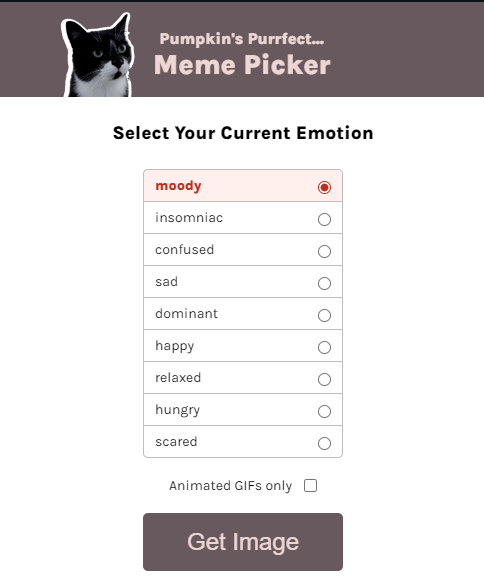

## Table of contents

- [Overview](#overview)

- [Projects](#projects)

  - [1-Cookie Consent App](#nft-site)
  - [2-Meme Picker App](#meme-picker)

  ## Overview

  Completed these projects that are parts of [Scrimba](https://scrimba.com/learn/frontend/)'s Essential JavaScript Concepts.  I mastered HTML/CSS and intermediate JavaScript in these projects.
  You can see the visual representations of the each app below.

  ## Projects

  ### 1-Cookie Consent App
  
  ### Visulation of the App

  
  
  ### Description

  - The project is designed to take personal informations within the cookie consent.

 
  ### What I Learned?
  

  - setTimeOut()
  - element.style
  - forms
  - FormData & get()
  - event.preventDefault()
  - CSS: row-reverse
  - toggling classes
  - disabled attribute
  - aria-label attribute
  - mouseenter event
  
  
  ### 2-Meme Picker App
  
  ### Visulation of the App

  
  
  
  ### Description

  - The project is designed to pick a cat GIF relevant with user's mood

 
  ### What I Learned?
  

  - for of()
  - radio & checkbox
  - getElementsByClassName()
  - querySelector()
  - classList.add(), .remove()
  - import/export
  - includes()
  - filter()
  - event.target
  

  
  
