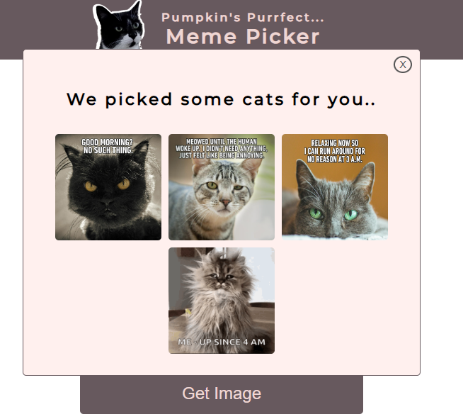

## Table of contents

- [Overview](#overview)

- [Projects](#projects)

  - [1-Cookie Consent App](#nft-site)
  - [2-Shopping List App](#shopping-list)
  - [3-Meme Picker App](#meme-picker)
  - [4-Twitter Clone App](#twitter-clone)

  ## Overview

  Completed these projects that are parts of [Scrimba](https://scrimba.com/learn/frontend/)'s Essential JavaScript Concepts.  I mastered HTML/CSS and intermediate JavaScript in these projects.
  You can see the visual representations of the each app below.

  ## Projects

  ### 1-Cookie Consent App
  
  ### Visulation of the App

  
  
  ### Description

  - The project is created to take personal informations within the cookie consent.

 
  ### What I Learned?
  

  - setTimeOut()
  - element.style
  - forms
  - FormData & get()
  - event.preventDefault()
  - CSS: row-reverse
  - toggling classes
  - disabled attribute
  - aria-label attribute
  - mouseenter event
  
  
  ### 2-Shopping List App
  
  ### Visulation of the App

  
  
  ### Description

  - The project is created to provide a list of shopping .

  
  
  ### 3-Meme Picker App
  
  ### [Live Link](https://scrimba-meme-picker.netlify.app/)
  
  ### Visulation of the App

  ### 
  ### 
  
  ### Description

  - The project is created to pick a cat GIF relevant with user's mood
  
  ### Stretch Goals: Completed!
  
  - Click outside the modal to close modal
  - Display more than one result (thumbnails in a gallery)
  - Refactor the UX
  

 
  ### What I Learned?
  

  - for of()
  - radio & checkbox
  - getElementsByClassName()
  - querySelector()
  - classList.add(), .remove()
  - import/export
  - includes()
  - filter()
  - event.target
  - mouseup event
  - window.addeventListener()
  
  
  ### 4-Twimba: Twitter Clone App
  
  ### [Live Link](https://scrimba-twitter-clone.netlify.app/)
  
  ### Visulation of the App

  ### 
  
  ### Description

  - The project provides a clone of Twitter using pure Javascript. Users can able;
    - Send a tweet to feed
    - List tweets' replies
    - Like an tweet
    - Retweet a tweet
  

 
  ### What I Learned?
  

  - textarea
  - data-attributes
  - conditionally render style
  - Not operator (!)
  - CDNs(add icons using fontawesome)
  - uuid
  - class.toggle
  - forEach
  

  
  
